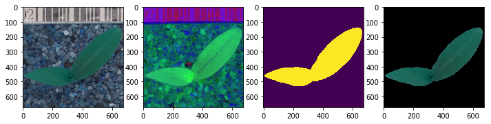

Solution to Plant Seedlings Classification Problem

https://www.kaggle.com/c/plant-seedlings-classification
## First Attempt

A simple Deep CNN architecture with 3 blocks of `Conv2D => Conv2D => MaxPooling2D => Dropout`.
##### Block 1
1. No. of conv layers: 2
2. Filters in each conv layer: 32

##### Block 2
1. No. of conv layers: 2
2. Filters in each conv layer: 64

##### Block 3
1. No. of conv layers: 2
2. Filters in each conv layer: 128

#### Kernel size: (3,3) 
#### Image Input: `load_img`
#### Image Resized: (128, 128)
#### Image Normalization: (0,1)
#### Imag Augmentation 
* Horizontal Flip
* Vertical Flip
* Zooming
* Rotation

#### Optimizer: Adam(learning_rate=0.1) 
#### Loss: Categorical CrossEntropy 
#### Epochs: 10
#### Time/Epoch: 20-24s

## Second Attempt

Deep CNN architecture with 3 blocks of `Conv2D => BatchNorm => Conv2D => MaxPooling => BatchNorm => Dropout` 
##### Block 1
1. No. of conv layers: 2
2. Filters in each conv layer: 64

##### Block 2
1. No. of conv layers: 2
2. Filters in each conv layer: 128

##### Block 3
1. No. of conv layers: 2
2. Filters in each conv layer: 256

#### Kernel size: (5,5) 
#### Image Input: `load_img`
#### Image Resized: (128, 128)
#### Image Normalization: (0,1)
#### Imag Augmentation 
* Horizontal Flip
* Vertical Flip
* Zooming
* Rotation

#### Optimizer: Adam 
#### Loss: Categorical CrossEntropy 
#### Epochs: 20
#### Time/Epoch: 40s
#### Callbacks
* CSVLogger
* ModelCheckPoint

## Third Attempt
Images are sharpened and background noise is removed.
Steps :
1. Blurring the Image.
2. Converting to HSV colorspace.
3. Creating a mask to extract only green colors using `inRange` function.
4. Closing the small gaps that might arise in continous objects.
5. Creating a Black Canvas.
6. Masking the original image with the mask created in step 3.

```
import cv2
import numpy as np
img = cv2.imread('sample.png')
blur = cv2.GaussianBlur(img, (5,5), 0)
hsv = cv2.cvtColor(blur, cv2.COLOR_BGR2HSV)
lower = (25, 40, 50)
upper = (75, 255, 255)
mask = cv2.inRange(hsv, lower, upper)
kernel = cv2.getStructuringElement(cv2.MORPH_ELLIPSE, (9,9))
mask = cv2.morphologyEx(mask, cv2.MORPH_CLOSE, kernel)

bmask = mask > 0
newimg = np.zeros_like(img, np.uint8)
newimg[bmask] = img[bmask]

import matplotlib.pyplot as plt
figure = plt.figure(figsize=(12,10))
figure.add_subplot(141)
plt.imshow(img)
figure.add_subplot(142)
plt.imshow(hsv)
figure.add_subplot(143)
plt.imshow(mask)
figure.add_subplot(144)
plt.imshow(newimg)
plt.show()
```



Deep CNN architecture with 3 blocks of `Conv2D => BatchNorm => Conv2D => MaxPooling => BatchNorm => Dropout` 
##### Block 1
1. No. of conv layers: 2
2. Filters in each conv layer: 64

##### Block 2
1. No. of conv layers: 2
2. Filters in each conv layer: 128

##### Block 3
1. No. of conv layers: 2
2. Filters in each conv layer: 256

#### Kernel size: (5,5) 
#### Image Input: `load_img`
#### Image Resized: (128, 128)
#### Image Normalization: (0,1)
#### Imag Augmentation 
* Horizontal Flip
* Vertical Flip
* Zooming
* Rotation

#### Optimizer: Adam 
#### Loss: Categorical CrossEntropy 
#### Epochs: 20
#### Time/Epoch: 38-40s
#### Callbacks
* CSVLogger
* ModelCheckPoint

## Fourth Attempt
Deep CNN architecture with 3 blocks of `Conv2D => BatchNorm => Conv2D => MaxPooling => BatchNorm => Dropout` 
##### Block 1
1. No. of conv layers: 2
2. Filters in each conv layer: 64

##### Block 2
1. No. of conv layers: 2
2. Filters in each conv layer: 128

##### Block 3
1. No. of conv layers: 2
2. Filters in each conv layer: 256

#### Kernel size: (5,5) 
#### Image Input: `cv2.imread()`
#### Image Resized: (80, 80)
#### Image Normalization: (0,1)
#### Imag Augmentation 
* Horizontal Flip
* Vertical Flip
* Zooming
* Rotation
* Height Shift
* Width Shift

#### Optimizer: Adam 
#### Loss: Categorical CrossEntropy 
#### Epochs: 20
#### Time/Epoch: 20s
#### Callbacks
* CSVLogger
* ModelCheckPoint

## Fifth Attempt

1. Images resized to (70,70).
2. Number of epochs: 20.

#### Annealing Technique. 
Learning Rate is dynamically decreased after every few epochs if accuracy is not improved.
With the __ReduceLROnPlateau__ function from Keras.callbacks, learning rate is reduced by a factor of 0.4 if the validation accuracy is not improved after 3 epochs.
```
learning_rate_reduction = ReduceLROnPlateau(monitor='val_acc', 
                                            patience=3, 
                                            verbose=1, 
                                            factor=0.4, 
                                            min_lr=0.00001)
```
Deep CNN architecture with 3 blocks of `Conv2D => BatchNorm => Conv2D => MaxPooling => BatchNorm => Dropout` 
##### Block 1
1. No. of conv layers: 2
2. Filters in each conv layer: 64

##### Block 2
1. No. of conv layers: 2
2. Filters in each conv layer: 128

##### Block 3
1. No. of conv layers: 2
2. Filters in each conv layer: 256

#### Kernel size: (5,5) 
#### Image Input: `cv2.imread()`
#### Image Resized: (70, 70)
#### Image Normalization: (0,1)
#### Imag Augmentation 
* Horizontal Flip
* Vertical Flip
* Zooming
* Rotation
* Height Shift
* Width Shift

#### Optimizer: Adam 
#### Loss: Categorical CrossEntropy 
#### Epochs: 20
#### Time/Epoch: 14-15minutes
#### Callbacks
* CSVLogger
* ModelCheckPoint